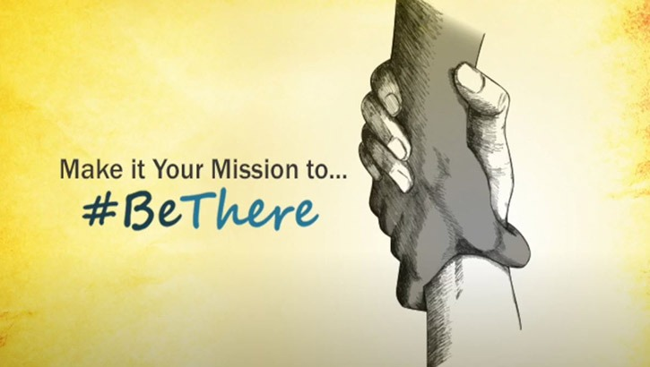
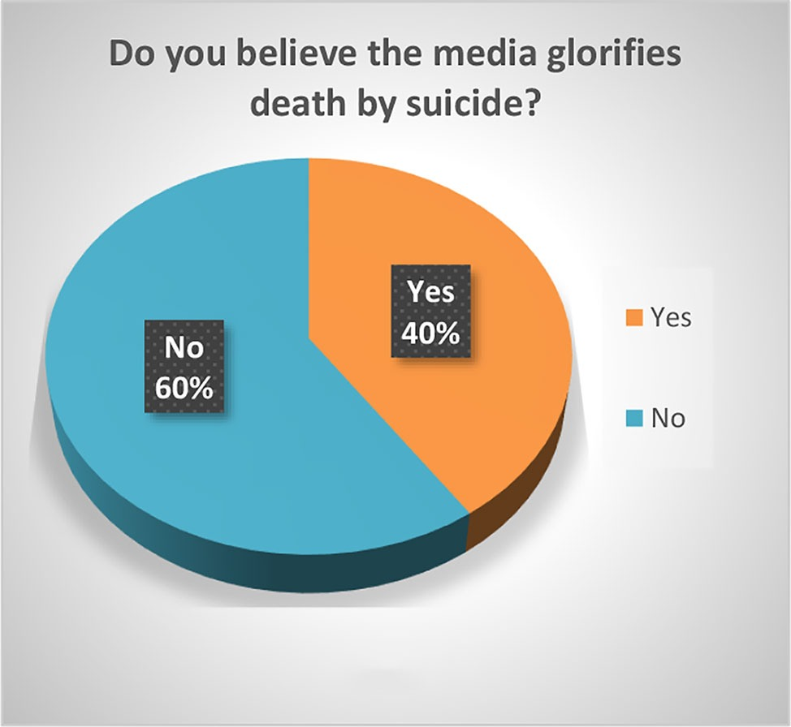

# Social media and suicide prevention

## Introduction
Individuals, families, and communities are all significantly impacted by suicide, which is a critical public health issue nowadays. The World Health Organization(WHO) estimates that over 800,000 suicides usually take place every year globally. In recent years, suicide has become a more significant global public health concern. According to the World Health Organization(WHO), suicide is estimated to be the second most common cause of death for those between the ages of 15 and 29 worldwide. It is crucial to consider social media's possible effects on suicide prevention given its pervasiveness in modern culture. An overview of the connection between social media and preventing suicide is provided in this paper, along with recommendations for the most effective ways to use social media in suicide prevention campaigns.

## Why Do People Commit Suicide?
There are numerous reasons for committing suicide but there are a few most common things why people suicide.
-	Mental Illness
-	Traumatic Stress
-	Substance use and Impulsivity
-	Loss or fear of loss
-	Hopelessness
-	Chronic pain and illness
-	Feeling like a burden to others
-	Social isolation
-	Accidental suicide
- Social media

## Impact of social media on suicide
There isn't just one reason why people commit suicide; it's a complicated, multifaceted problem. Social media has, however, been linked to suicide risk, especially in young people. Social media can both have good and bad effects on mental health, including suicidal thoughts, according to studies. On the one hand, social media can offer people a sense of belonging, encouragement, and a stage for self-expression. On the other hand, social media can also worsen feelings of seclusion, loneliness, and despair, especially in people who are exposed to distressing information or events. According to an analysis of survey study data from 2004 to 2010, the lifetime victimization rates of cyberbullying ranged from 22% to 41%, and the lifetime offending rates ranged from 11.5% to 20.1% which is increasing. A key query is if there is a correlation between Internet usage, particularly social media, and suicide rates in the general population. Despite their limitations, several preliminary research has started to answer this. For instance, Shah used information from the websites of the World Health Organization (WHO) and the United Nations Development Program (UNDP) to undertake a cross-national study that looked at the relationship between the proportion of Internet users and the suicide rates among the general population. He showed a link between Internet use and the prevalence of suicide in the general population. The prevalence of Internet use was independently related to the general population suicide rates in men (P =.001) and neared statistical significance in women (P =.074), according to multiple regression analysis. In a time-series analysis utilizing data from 1987 to 2005, Hagihara found a statistically significant positive association between the prevalence of Internet-using households in Japan and the risk of general population male suicide (P .05). Nowadays in every country has been showing that suicide is increasing also posting the video on social media.

## The role of social media in suicide prevention
Social media can be utilized to prevent suicide despite any possible negative effects on this issue. Social media can increase understanding of the issue and discourage struggling individuals from seeking help by reducing the stigma related to mental health and suicide.Social networking sites for suicide prevention can help people connect with others who have had similar experiences and raise knowledge of resources like crisis hotlines, preventative programs, and other forms of support and education. The American Foundation for Suicide Prevention, the National Suicide Prevention Lifeline, and the 988 Suicide & Crisis Lifeline each have Facebook pages with more than 10 million fans as of January 2023. Which is working for people not to do suicide. Additionally, 385 blog accounts on Blogger.com and 580 groups on Twitter with the designation "suicide prevention." YouTube also has many videos devoted to suicide prevention, including those in the form of public service announcements. Also, discovered instances of functions on websites and social media platforms that permitted proactive prevention capabilities. 
When a keyword search contains the phrase, 
> "I want to die"

for instance, Google's search engine includes a function that places a link and message about the National Suicide Prevention Lifeline at the top of the search results page. When we carried out the same search on Yahoo, we came across links related to suicide prevention. 
<iframe width="560" height="315" src="https://www.youtube.com/embed/4N-GeoGnFN8" title="YouTube video player" frameborder="0" allow="accelerometer; autoplay; clipboard-write; encrypted-media; gyroscope; picture-in-picture; web-share" allowfullscreen></iframe>

## Challenges of using social media in suicide prevention
Despite its potential advantages, social media also poses several difficulties in preventing suicide. One concern is preventing the spread of bad content, such as material encouraging suicide or self-harm. Furthermore, it can be challenging to spot those who are at risk of suicide and to act successfully due to the anonymity of social media. Furthermore, keeping up with the most recent information and resources and ensuring that it is correct and useful are both challenging tasks due to social media's rapid pace.

## Best Practices for Utilizing Social Media in Suicide Prevention for the future
The ideal techniques are:
### Collaborating with experts in suicide prevention and mental health
First, sure that the knowledge and resources made available via social media are accurate and supported by research, social media platforms should collaborate with experts in suicide prevention and mental health.
### Providing resources and assistance 
Social media sites should make it simple for people who might be having suicidal thoughts or a crisis to access services and support. This may include information on crisis hotlines, online support forums, and other resources.
### Fostering good and helpful interactions
Social media platforms should promote helpful and positive interactions among users while discouraging the dissemination of harmful and bad information. 
<iframe width="560" height="315" src="https://www.youtube.com/embed/n3ZkL5T5Y5M" title="YouTube video player" frameborder="0" allow="accelerometer; autoplay; clipboard-write; encrypted-media; gyroscope; picture-in-picture; web-share" allowfullscreen></iframe>

## Role of Social Media Companies
Social media firms must encourage safe and wholesome online communities. They can achieve this by putting policies and procedures in place to stop the dissemination of harmful content and to assist people who may be at risk of suicide. This entails keeping an eye out for warning indicators and giving instant access to crisis help and resources. 

## Conclusion
In conclusion, social media can have a double-edged effect on efforts to prevent suicide. It might increase feelings of helplessness and loneliness, but it can also serve as a platform for connection and support. We can take action to use social media as a tool for prevention, lowering the risk of suicide and encouraging better mental health outcomes, by knowing the link between social media and suicide.
> “You can do things today that shape your unknown future. Make every day the time when you turn what you don't know into what would like to happen.” — Michael Nulty.

## References
- World Health Organization Mental health: suicide prevention. https://www.who.int/news-room/fact-sheets/detail/suicide//
-	Nancy Schimelpfening, MS is the administrator for the non-profit depression support group Depression Sanctuary,2021.
https://www.verywellmind.com/why-do-people-commit-suicide-1067515//
- Hagihara A, Tarumi K, Abe T. Media suicide-reports, Internet use and the occurrence of suicides between 1987 and 2005 in Japan. BMC Public Health. 2007;7:321. [PMC free article] [PubMed] [Google Scholar]
- Kowalski RM, Limber SP, Agatston PW. Cyber Bullying: Bullying in the Digital Age. Malden, MA: Blackwell Publishing Ltd; 2008 [Google Scholar]
- Shah A. The relationship between general population suicide rates and the Internet: a cross-national study. Suicide Life Threat Behave.  [Google Scholar]
-	World Health Organization Mental health: suicide prevention. https://www.who.int/news-room/fact-sheets/detail/suicide//
-	Nancy Schimelpfening, MS is the administrator for the non-profit depression support group Depression Sanctuary,2021.
https://www.verywellmind.com/why-do-people-commit-suicide-1067515//
-	Hagihara A, Tarumi K, Abe T. Media suicide-reports, Internet use and the occurrence of suicides between 1987 and 2005 in Japan. BMC Public Health. 2007;7:321. [PMC free article] [PubMed] [Google Scholar]
-	Kowalski RM, Limber SP, Agatston PW. Cyber Bullying: Bullying in the Digital Age. Malden, MA: Blackwell Publishing Ltd; 2008 [Google Scholar]
-	Shah A. The relationship between general population suicide rates and the Internet: a cross-national study. Suicide Life Threat Behave.  [Google Scholar]
